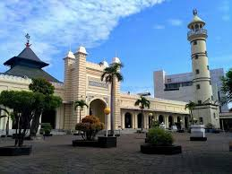

<html>
<head>
    <meta charset="UTF-8">
    <meta name="viewport" content="width=device-width, initial-scale=1.0">
    <title>Wisata Religi Indonesia</title>
    
</head>
<body>

<header>
    <h1>Pekalongan Punnya Cerita</h1>
    
Mari jelajahi keindahan spiritual di Pekalongan.

</header>

    <h2>Tempat Wisata Religi Populer</h2>

    

        <h3>Masjid Agung Al-Jami Pekalongan</h3>
        
        
Masjid Agung Al-Jami Pekalongan adalah masjid yang terletak di sebelah alun-alun kota pekalongan. Masjid peninggalan sejarah ini menjadi salah satu ciri khas Kota Pekalongan. Meskipun telah dibangun beberapa Masjid baru yang tak kalah megahnya, namun Masjid Agung Al-Jami' ini tetap tak tergantikan sebagai simbol islami warga Pekalongan.

        
Masjid ini sudah berusia 158 tahun. Pembangunan masjid ini diprakarsai Raden Ario Wirio Tumengung Adi Negoro. Ruangan-ruangan di masjid ini, terutama tempat salat utama, banyak dihiasi ornamen asli. Kayu-kayunya masih dari bahan-bahan yang pertama kali digunakan untuk pembangunan masjid.Di bangunan utama ada delapan tiang kayu yang dikombinasikan dengan 22 tiang beton. Atap kayunya juga masih asli menggunakan batang kayu dan tak ada sambungannya.

        
Masjid Agung Al Jami berarsitektur Jawa-Arab. Ini bisa dilihat dari kubahnya yang berbentuk joglo. Sementara arsitek Arab tampak dari serambi masjid. Di depan ruangan masjid ada tiga ruangan. Di tengah tempat iman. Sebelah kanan mimbar tempat khatib memberikan ceramah, dan bagian kiri tadinya khusus tempat bupati saat itu beribadah. Namun kini ruangan tersebut sudah tak diistimewakan lagi. Di sebelah kanan bangunan masjid terdapat menara masjid.

    

    

        <h3>Makam Habib Ahmad bin Abdullah bin Thalib al-Atthas Pekalongan</h3>
        
        
Komplek pemakaman Sapuro Pekalongan yang terletak di Kelurahan Sapuro Kebulen Kecamatan Pekalongan Barat, sekitar 200 meter dari jalan utama Pekalongan hampir dipastikan setiap harinya tidak pernah sepi dari para peziarah yang datang dari berbagai penjuru kota di Tanah Air.

        
Puluhan kendaraan rombongan peziarah yang menggunakan bis selalu memadati area parkir yang tersedia di sekitar komplek pemakaman seorang ulama besar yakni Habib Ahmad bin Abdullah bin Thalib al-Atthas.

        
Meski tidak termasuk ulama yang tercantum dalam kelompok Walisongo, Habib Ahmad bin Abdullah bin Thalib al-Athas tercatat sebagai seorang ulama besar yang membawa pengaruh terhadap perkembangan agama Islam di kawasan Pantura Barat.

        
Maka dapat dipastikan setiap rombongan wisata ziarah walisongo, makam Habib Ahmad selalu menjadi tujuan peziarah yang akan menuju Makam Sunan Gunung Jati Cirebon atau menuju makam Sunan Kalijogo Demak.

    

    

        <h3>Makam Ki Ageng Rogoselo dan Ki Gede Penatas Angin</h3>
        
        
Desa Rogoselo masuk dalam Kecamatan Doro, Kabupaten Pekalongan. Sekitar 30 menit berkendara dari Alun-alun Kajen dan sekitar 25 menit dari Terminal Doro. Di balik keindahan alam dan kesejukan hawanya, Rogoselo menyimpan mutiara berharga yang harus bersama kita jaga. Mutiara itu adalah makam beberapa ulama yang berjasa menyebarkan agama Islam di daerah tersebut. Sebenarnya ada beberapa makam ulama atau sesepuh di Desa Rogoselo, namun yang paling masyhur adalah makam Ki Ageng Rogoselo dan makam Ki Gede Penatas Angin.

        
Makam Ki Ageng Rogoselo berada di Desa Rogoselo, berseberangan dengan Masjid Jami Rogoselo, sekaligus tak jauh dari bendungan Rogoselo. Untuk mencapai makam beliau, peziarah harus menaiki anak tangga yang tidak terlalu panjang, hanya membutuhkan waktu sekitar 3 sampai 4 menit untuk sampai di atas. Di atas hanya ada satu bangunan, yakni bangunan  makam Ki Ageng Rogoselo dan beberapa tokoh lainnya.

    

<footer>
    
&copy; 2024 Wisata Religi Pekalongan | Jelajahi Keindahan Spiritual

</footer>

</body>
</html>
